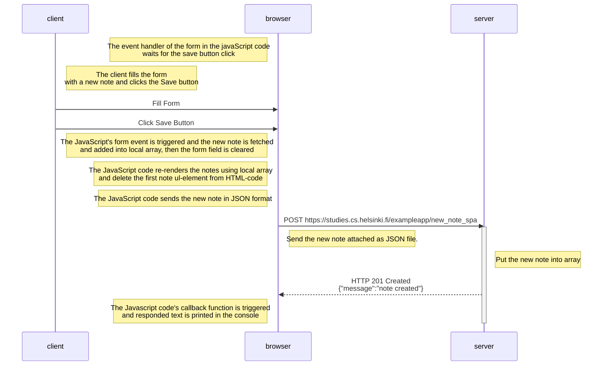

```mermaid
sequenceDiagram
    participant client
    participant browser
    participant server
    
    Note left of browser: The event handler of the form in the javaScript code<br/>waits for the save button click   
    Note right of client: The client fills the form<br/>with a new note and clicks the Save button 
    
    client->>browser: Fill Form
    client->>browser: Click Save Button
    Note left of browser: The JavaScript's form event is triggered and the new note is fetched<br/>and added into local array, then the form field is cleared
    Note left of browser: The JavaScript code re-renders the notes using local array<br/>and delete the first note ul-element from HTML-code  
    Note left of browser: The JavaScript code sends the new note in JSON format
    browser->>server: POST https://studies.cs.helsinki.fi/exampleapp/new_note_spa
    activate server
    Note right of browser: Send the new note attached as JSON file.
    Note right of server: Put the new note into array
    server-->>browser: HTTP 201 Created<br/>{"message":"note created"}
    Note left of browser:  The Javascript code's callback function is triggered<br/>and responded text is printed in the console
    deactivate server    

```
