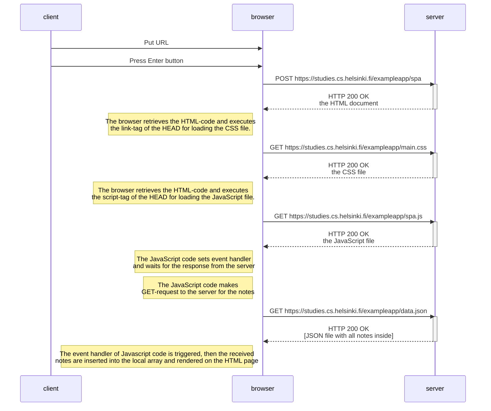

```mermaid
sequenceDiagram
    participant client
    participant browser
    participant server
    
    client->>browser: Put URL 
    client->>browser: Press Enter button
    browser->>server: POST https://studies.cs.helsinki.fi/exampleapp/spa
    activate server
    server-->>browser: HTTP 200 OK<br/>the HTML document
    deactivate server

    Note left of browser: The browser retrieves the HTML-code and executes<br/>the link-tag of the HEAD for loading the CSS file.
    browser->>server: GET https://studies.cs.helsinki.fi/exampleapp/main.css
    activate server
    server-->>browser: HTTP 200 OK<br/>the CSS file
    deactivate server

    Note left of browser: The browser retrieves the HTML-code and executes<br/>the script-tag of the HEAD for loading the JavaScript file.
    browser->>server: GET https://studies.cs.helsinki.fi/exampleapp/spa.js
    activate server
    server-->>browser: HTTP 200 OK<br/>the JavaScript file
    deactivate server

    Note left of browser: The JavaScript code sets event handler<br/>and waits for the response from the server  
    Note left of browser: The JavaScript code makes<br/>GET-request to the server for the notes
    browser->>server: GET https://studies.cs.helsinki.fi/exampleapp/data.json
    activate server
    server-->>browser: HTTP 200 OK<br/>[JSON file with all notes inside]
    deactivate server

    Note left of browser: The event handler of Javascript code is triggered, then the received<br/> notes are inserted into the local         array and rendered on the HTML page
    

```
