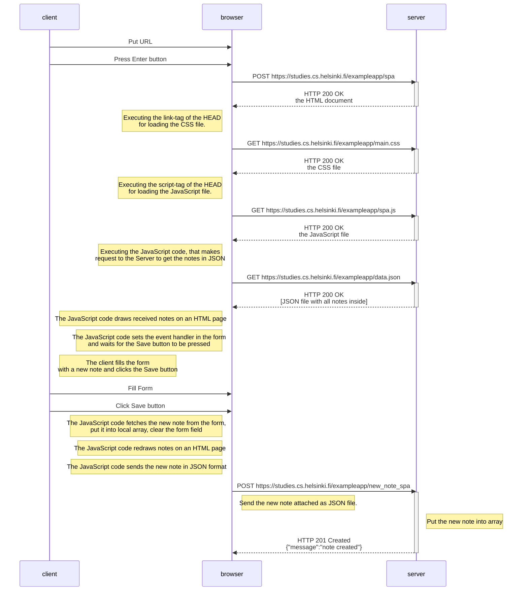

```mermaid
sequenceDiagram
    participant client
    participant browser
    participant server
    
    client->>browser: Put URL 
    client->>browser: Press Enter button
    browser->>server: POST https://studies.cs.helsinki.fi/exampleapp/spa
    activate server
    server-->>browser: HTTP 200 OK<br/>the HTML document
    deactivate server

    Note left of browser: Executing the link-tag of the HEAD<br/>for loading the CSS file.
    browser->>server: GET https://studies.cs.helsinki.fi/exampleapp/main.css
    activate server
    server-->>browser: HTTP 200 OK<br/>the CSS file
    deactivate server

    Note left of browser: Executing the script-tag of the HEAD<br/>for loading the JavaScript file.
    browser->>server: GET https://studies.cs.helsinki.fi/exampleapp/spa.js
    activate server
    server-->>browser: HTTP 200 OK<br/>the JavaScript file
    deactivate server

    Note left of browser: Executing the JavaScript code, that makes<br/>request to the Server to get the notes in JSON 
    browser->>server: GET https://studies.cs.helsinki.fi/exampleapp/data.json
    activate server
    server-->>browser: HTTP 200 OK<br/>[JSON file with all notes inside]
    deactivate server

    Note left of browser: The JavaScript code draws received notes on an HTML page 
    Note left of browser: The JavaScript code sets the event handler in the form<br/>and waits for the Save button to be pressed 
    Note right of client: The client fills the form<br/>with a new note and clicks the Save button 
    
    client->>browser: Fill Form
    client->>browser: Click Save button
    Note left of browser: The JavaScript code fetches the new note from the form,<br/>put it into local array, clear the form field
    Note left of browser: The JavaScript code redraws notes on an HTML page 
    Note left of browser: The JavaScript code sends the new note in JSON format
    browser->>server: POST https://studies.cs.helsinki.fi/exampleapp/new_note_spa
    activate server
    Note right of browser: Send the new note attached as JSON file.
    Note right of server: Put the new note into array
    server-->>browser: HTTP 201 Created<br/>{"message":"note created"}
    deactivate server    

```
