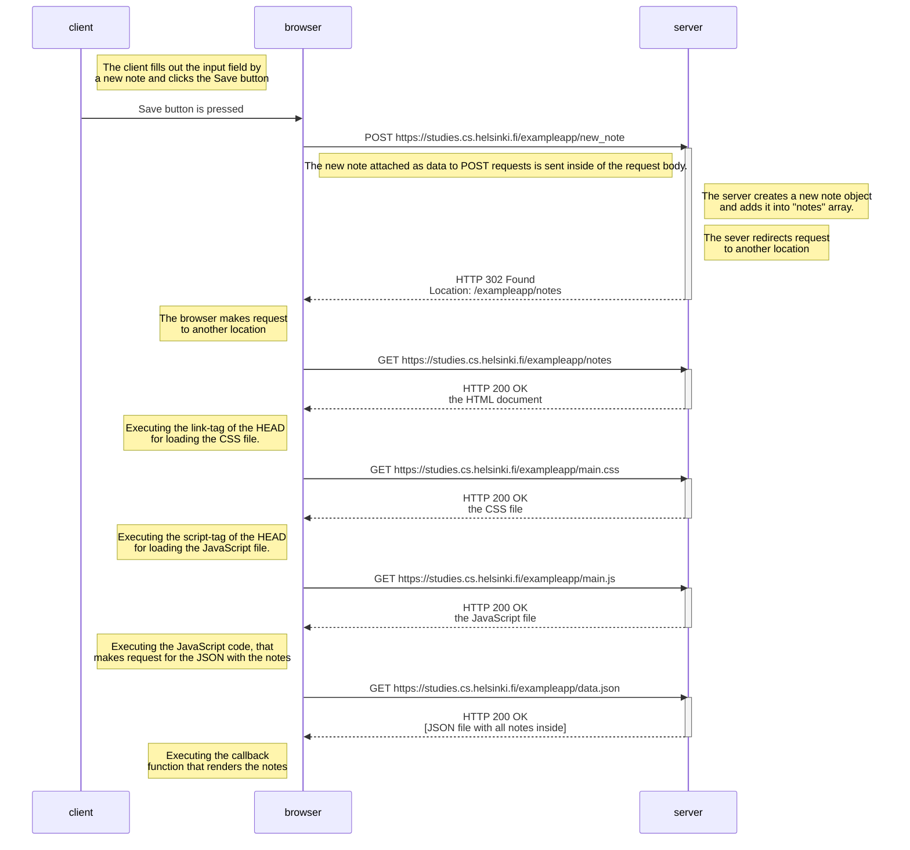

```mermaid
sequenceDiagram
    participant client
    participant browser
    participant server
    
    Note right of client: The client fills out the input field by<br/>a new note and clicks the Save button
    client->>browser: Save button is pressed
    browser->>server: POST https://studies.cs.helsinki.fi/exampleapp/new_note
    activate server
    Note right of browser: The new note attached as data to POST requests is sent inside of the request body.
    Note right of server: The server creates a new note object<br/>and adds it into "notes" array.
    Note right of server: The sever redirects request<br/>to another location                         
    server-->>browser: HTTP 302 Found<br/>Location: /exampleapp/notes
    deactivate server

    Note left of browser: The browser makes request<br/>to another location
    browser->>server: GET https://studies.cs.helsinki.fi/exampleapp/notes
    activate server
    server-->>browser: HTTP 200 OK<br/>the HTML document
    deactivate server

    Note left of browser: Executing the link-tag of the HEAD<br/>for loading the CSS file.
    browser->>server: GET https://studies.cs.helsinki.fi/exampleapp/main.css
    activate server
    server-->>browser: HTTP 200 OK<br/>the CSS file
    deactivate server
    Note left of browser: Executing the script-tag of the HEAD<br/>for loading the JavaScript file.

    browser->>server: GET https://studies.cs.helsinki.fi/exampleapp/main.js
    activate server
    server-->>browser: HTTP 200 OK<br/>the JavaScript file
    deactivate server
    
    Note left of browser: Executing the JavaScript code, that<br/>makes request for the JSON with the notes   
    
    browser->>server: GET https://studies.cs.helsinki.fi/exampleapp/data.json
    activate server
    server-->>browser: HTTP 200 OK<br/>[JSON file with all notes inside]
    deactivate server    

    Note left of browser: Executing the callback<br/>function that renders the notes
```
